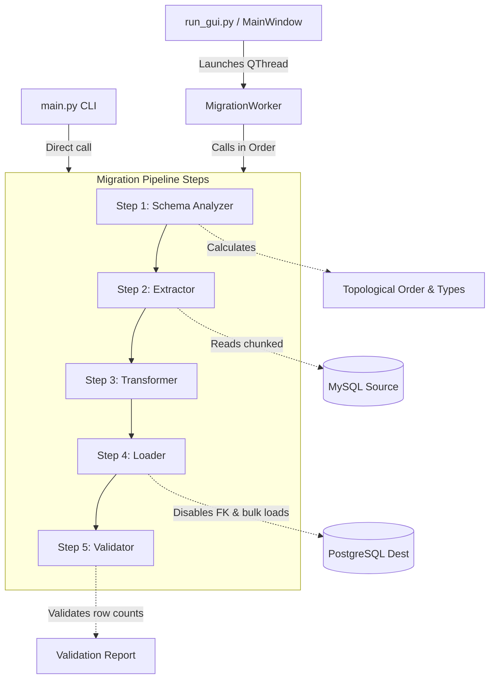

# Project Architecture & Workflow Analysis

This document provides a comprehensive analysis of the MySQL to PostgreSQL Migration Tool, detailing its architecture, components, data flows, and workflow diagrams.

---

## 1. Directory Structure

```
MyMigrationDB/
├── config/
│   ├── __init__.py
│   └── db_config.py           # Database credentials, connection factories, and engine pools
├── data_generation/
│   ├── generate_data.py       # Seeds the source MySQL database with test data
│   ├── database_er_details.md
│   └── database_schema_details.txt
├── migration/
│   ├── extract.py             # Data extraction from MySQL (Chunked Pandas queries)
│   ├── transformer.py         # Data types normalization (JSON, Boolean, UUID conversion)
│   └── loader.py              # PostgreSQL schema generation, bulk loading, sequence reset, and FK addition
├── validation/
│   └── Validate.py            # Exact row count validation and report generation
├── ui/
│   ├── __init__.py            # Empty package marker
│   ├── main_window.py         # Consolidated PyQt5 window interface
│   └── migration_worker.py    # Asynchronous worker thread (QThread) executing pipeline steps
├── main.py                    # Command-Line Interface (CLI) pipeline runner
└── run_gui.py                 # GUI launcher script
```

---

## 2. High-Level Architecture Flowchart

The following diagram illustrates how the components interact. The system supports two interfaces: the console CLI (`main.py`) and the consolidated GUI (`run_gui.py` + `main_window.py` + `migration_worker.py`).



---

## 3. Detailed Step-by-Step Pipeline Flowchart

The workflow executed inside `MigrationWorker.run()` (or `main.py`) proceeds through 5 critical phases:

```mermaid
flowchart TD
    Start([Start Migration]) --> S1[Step 1: analyze_schema]
    
    %% Step 1 details
    S1 --> S1A["Query MySQL Foreign Key graph"]
    S1A --> S1B["Determine Topological Sorting (TopologicalSorter)"]
    S1B --> S1C["Detect special columns (UUID, JSON, Tinyint bools)"]
    S1C --> S2[Step 2: Extract Tables]
    
    %% Step 2 details
    S2 --> S2A["Loop tables in topological order"]
    S2A --> S2B["Read table data chunk-by-chunk (Pandas read_sql_table)"]
    S2B --> S2C["Fetch table schema definitions"]
    S2C --> S3[Step 3: Transform Data]
    
    %% Step 3 details
    S3 --> S3A["Parse JSON string fields into Python dicts"]
    S3A --> S3B["Cast Tinyint(1) integers to bools (0 -> False, 1 -> True)"]
    S3B --> S3C["Normalize UUID strings to standardized formats"]
    S3C --> S4[Step 4: Load to PostgreSQL]
    
    %% Step 4 details
    S4 --> S4A["Set replication role to 'replica' (Disables FK constraint checks)"]
    S4A --> S4B["Create target tables (Drops existing tables first)"]
    S4B --> S4C["Insert records in bulk (psycopg2.extras.execute_values)"]
    S4C --> S4D["Reset SERIAL sequences to MAX(id) + 1"]
    S4D --> S4E["Restore replication role to 'DEFAULT'"]
    S4E --> S4F["Re-apply all Foreign Key constraints (ALTER TABLE)"]
    S4F --> S5[Step 5: Validate Migration]
    
    %% Step 5 details
    S5 --> S5A["Query row counts from MySQL and PostgreSQL"]
    S5A --> S5B["Compare row counts per table (validate_row_counts)"]
    S5B --> S5C["Generate CSV report under 'reports/validation_report.csv'"]
    S5C --> End([Migration Done])
```



---

## 4. Module-by-Module Walkthrough

### 4.1. Configuration Layer (`config/db_config.py`)
- **Responsibility**: Loads `.env` credentials, validates environment variables, and exports database engines and connections.
- **Key Detail**: Utilizes `use_pure=True` connect arguments for MySQL. This prevents the C implementation DLL from loading, preventing access violations and crashes with PyQt5 in graphics driver environments.

### 4.2. Schema Analyzer (`utils/schema_analyzer.py`)
- **Responsibility**: Analyzes the database metadata to construct an execution plan.
- **Topological Sorting**: Uses Python's `graphlib.TopologicalSorter` to compute an ordered list of tables. Dependent child tables are processed only after parent tables are successfully loaded.
- **Type Discovery**: Scans table metadata to build maps for:
  - **UUID tables**: Target VARCHAR(36) primary keys.
  - **JSON columns**: MySQL text fields containing structured JSON strings.
  - **Boolean columns**: TINYINT(1) or standard boolean flags.

### 4.3. Extractor (`migration/extract.py`)
- **Responsibility**: Streams rows from the MySQL database.
- **Memory Optimization**: Leverages Pandas `read_sql_table` with `chunksize=1000` to avoid loading millions of rows into memory simultaneously.

### 4.4. Transformer (`migration/transformer.py`)
- **Responsibility**: Sanitizes values before load.
- **JSON Converter**: Converts JSON strings back into dictionary objects, enabling PostgreSQL's JSONB driver to parse and validate them on insertion.
- **Boolean Normalizer**: Maps numerical database representations to strict boolean primitives (`True`, `False`, or `None`).

### 4.5. Loader (`migration/loader.py`)
- **Responsibility**: Recreates structures and loads data.
- **Constraint Bypassing**: Temporarily disables constraints by setting `session_replication_role = replica`. This permits loading data in chunks without triggering foreign key check violations.
- **Bulk Insert**: Employs `psycopg2.extras.execute_values` for high-throughput batch inserts.
- **Foreign Keys Re-application**: Constraints are safely re-applied in one batch after the data load is finalized.

### 4.6. Validator (`validation/Validate.py`)
- **Responsibility**: Compares table row counts between MySQL and PostgreSQL.
- **Output**: Logs success rate metrics and generates a local summary spreadsheet file `reports/validation_report.csv`.
