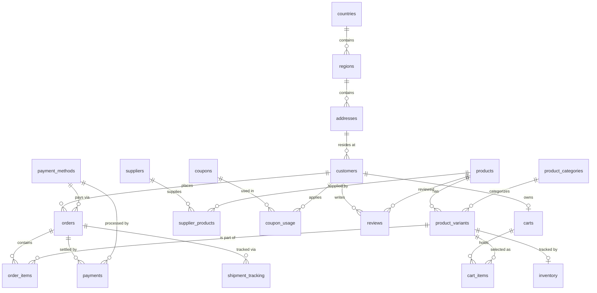

# Database ER Diagram & Detail Description

This document provides a comprehensive analysis and detailed entity-relationship (ER) description of the migration project database schema. The database consists of **100 tables** split into two major categories: **20 highly connected E-commerce tables** and **80 independent domain tables** (divided into 7 business modules).

---

## 1. Core Architecture Overview

- **Connected Tables (20)**: Form a formal relational database schema implementing a standard transactional E-commerce workflow with foreign key constraints, indexes, and referential integrity.
- **Independent Tables (80)**: Represent modular business systems (HR, Finance, Logistics, CRM, IT, CMS, Education). These tables do not contain database-level `FOREIGN KEY` references, making them decoupled and easier to migrate individually or split into microservices. Instead, they use logic-level references (e.g., `employee_ref`, `student_ref`, `course_ref`).

---

## 2. Connected E-Commerce System (20 Tables)

The E-commerce section models the relationships between geography, customers, suppliers, inventory, cart transactions, ordering, payments, and product reviews.

### 2.1 E-Commerce ER Diagram
The following Mermaid diagram visualizes the primary key / foreign key relationships within the E-commerce sub-system:

---

### 2.2 Table-by-Table Details (E-Commerce)

Below is the detailed schema specification for the 20 connected tables:

| # | Table Name | Key Columns & Constraints | Relationship Type & References | Description |
|---|------------|---------------------------|--------------------------------|-------------|
| **1** | `countries` | `id` (PK, Serial) `name` (Unique) `iso_code` (Unique) | None | Stores master country data. |
| **2** | `regions` | `id` (PK, Serial) Unique(`country_id`, `code`) | Many-to-One to `countries(id)` | Stores states/provinces associated with a country. |
| **3** | `addresses` | `id` (PK, Serial) | Many-to-One to `regions(id)` | Stores physical addresses. |
| **4** | `customers` | `id` (PK, Serial) `email` (Unique) | Many-to-One to `addresses(id)` | User details of retail customers. |
| **5** | `suppliers` | `id` (PK, Serial) `name` (Unique) | None | Product vendors and manufacturers. |
| **6** | `products` | `id` (PK, Serial) `sku` (Unique) | None | Core product details (base name, description, base price). |
| **7** | `product_categories` | `id` (PK, Serial) `name` (Unique) | None | Taxonomy for grouping products. |
| **8** | `product_variants` | `id` (PK, Serial) `sku` (Unique) | Many-to-One to `products(id)` & `product_categories(id)` | Particular SKUs with specific options (e.g. Size, Color) and price modifiers. |
| **9** | `inventory` | `id` (PK, Serial) | One-to-One to `product_variants(id)` (Unique constraint) | Stock levels of individual variants at specific warehouses. |
| **10** | `payment_methods` | `id` (PK, Serial) `name` (Unique) | None | Supported payment gateways (e.g., Credit Card, PayPal). |
| **11** | `orders` | `id` (PK, Serial) `order_number` (Unique) | Many-to-One to `customers(id)` & `payment_methods(id)` | Transactional headers detailing total amounts and order status. |
| **12** | `order_items` | `id` (PK, Serial) Unique(`order_id`, `variant_id`) | Many-to-One to `orders(id)` & `product_variants(id)` | Line items detailing the quantity and checkout unit price of ordered variants. |
| **13** | `supplier_products` | `id` (PK, Serial) Unique(`supplier_id`, `product_id`) | Many-to-Many join for `suppliers(id)` & `products(id)` | Keeps track of supplier wholesale prices and lead times. |
| **14** | `payments` | `id` (PK, Serial) `transaction_reference` (Unique) | Many-to-One to `orders(id)` & `payment_methods(id)` | Records invoice payments and transactional results. |
| **15** | `coupons` | `id` (PK, Serial) `code` (Unique) | None | Promotional discount codes. |
| **16** | `coupon_usage` | `id` (PK, Serial) Unique(`coupon_id`, `customer_id`, `used_at`) | Many-to-One to `coupons(id)` & `customers(id)` | Historical records showing when customers redeemed coupons. |
| **17** | `shipment_tracking` | `id` (PK, Serial) `tracking_number` (Unique) | Many-to-One to `orders(id)` | Fulfillment carrier information and delivery tracking milestones. |
| **18** | `reviews` | `id` (PK, Serial) Unique(`customer_id`, `product_id`) | Many-to-One to `customers(id)` & `products(id)` | Customer feedback, ratings, and comments per product. |
| **19** | `carts` | `id` (PK, Serial) | One-to-One to `customers(id)` (Unique constraint) | Active shopping cart sessions per customer. |
| **20** | `cart_items` | `id` (PK, Serial) Unique(`cart_id`, `variant_id`) | Many-to-One to `carts(id)` & `product_variants(id)` | Selected product variants and quantities residing in active carts. |

---

## 3. Independent Business Domains (80 Tables)

These tables are categorized into 7 domains. Although they model logical connections, they are design-uncoupled (no foreign key constraints) to simplify standalone schema migrations.

### 3.1 Human Resources (HR) Module (11 Tables)
*Contains details regarding staff members, salaries, schedules, and training.*
- **`employees`**: Uses `UUID` as primary key. Tracks core team details (status, hire date, contact details).
- **`departments`**: Code-oriented structure for grouping staff and identifying budgets.
- **`job_roles`**: Grade-level salary brackets (min/max salary details).
- **`payroll_records`**: Logs monthly compensation metrics (gross pay, deductions, net pay) mapped via `employee_ref`.
- **`leave_requests`**: Logs vacation and sick leave statuses (pending, approved, rejected).
- **`benefits_packages`**: Insurance and healthcare coverage packages.
- **`employee_skills`**: Track skills, certifications, and experience levels.
- **`performance_reviews`**: Annual review logs, grading, and targets.
- **`timesheets`**: Logs daily work/overtime hours and descriptions.
- **`training_sessions`**: Scheduled courses, trainers, and sizes.
- **`employment_contracts`**: Mapped uniquely to `employee_ref`, logging payroll terms and contract durations.

### 3.2 Finance & Accounting Module (11 Tables)
*Handles transactional ledger logging, budgeting, asset depreciation, and invoice records.*
- **`gl_accounts`**: Chart of Accounts mapping current balances and types (Asset, Liability, Equity, Revenue, Expense).
- **`journal_entries`**: Double-entry ledger records.
- **`tax_records`**: Captures sales and corporate tax filings by period/jurisdiction.
- **`budget_allocations`**: Mapped by department code and fiscal year.
- **`invoices`**: Uses `UUID` as primary key. Tracks billing details and customer codes.
- **`expense_reports`**: Reimbursements and claims tracking.
- **`bank_transactions`**: Checks bank statement balances and reconciliation states.
- **`purchase_orders`**: Vendor purchase receipts.
- **`depreciation_schedules`**: Capital asset tracking using Straight-Line or Double-Declining methods.
- **`fiscal_periods`**: Identifies open/closed accounting months.
- **`currency_rates`**: Tracks exchange rate feeds.

### 3.3 Logistics Module (11 Tables)
*Models physical warehouse facilities, transport networks, vehicle tracking, and declarations.*
- **`warehouses`**: Tracks physical spaces and storage capacity in cubic meters.
- **`vehicles`**: Tracks delivery vehicles (VIN, license plates, fuel types, and weight capacities).
- **`delivery_routes`**: Distance, routes, and duration.
- **`fuel_logs`**: Logs fuel usage and price metrics.
- **`maintenance_records`**: Odometer-based vehicle repairs and servicing.
- **`shipping_containers`**: Standard cargo box numbers, company ownerships, and weight limits.
- **`freight_carriers`**: Preffered commercial shippers (SCAC codes).
- **`port_records`**: Shipping harbors, coordinates, terminals, and capacities.
- **`customs_declarations`**: International trade custom status and duty logs.
- **`cargo_manifests`**: Vessel manifests, voyage numbers, and total cargo weights.
- **`driver_logs`**: Logs driving/on-duty hours to ensure compliance with transport regulations.

### 3.4 Customer Relationship Management (CRM) Module (11 Tables)
*Houses sales leads, target marketing lists, pipelines, and feedback logs.*
- **`leads`**: Captures email, phone, and lead scores.
- **`campaigns`**: Track marketing costs vs budget.
- **`email_logs` & `sms_logs`**: Communications dispatch histories and open/bounce telemetry metrics.
- **`survey_responses`**: Captures user score ratings and reviews.
- **`marketing_lists`**: Group segments for lists.
- **`sales_pipelines`**: Progression stages and close probabilities.
- **`customer_feedback`**: Logs severity, ticket assignments, and resolution states.
- **`webinar_attendees`**: Tracks registration and attendance durations.
- **`competitor_trackers`**: Web scraping target monitoring for price indexing.
- **`referral_programs`**: Reward codes and values.

### 3.5 IT & System Administration Module (12 Tables)
*Deals with authentication tokens, security policy compliance, server telemetry, and job schedules.*
- **`audit_logs` & `error_logs`**: Core diagnostic logging. Uses `JSONB` for capturing old/new values in edits.
- **`system_configs`**: Configurations, types, and categories.
- **`api_keys`**: Uses `UUID` as primary key. Hashed credentials and rate limit allocations.
- **`scheduled_jobs`**: Cron patterns and job class parameters.
- **`user_sessions`**: Captures session payloads, IPs, and user agents.
- **`server_metrics`**: CPU/RAM/Disk and network statistics.
- **`backup_schedules`**: Path configs, bucket locations, and retention rules.
- **`security_policies`**: Compliance definitions.
- **`network_nodes`**: MAC/IP address configurations on server racks.
- **`access_tokens`**: Blacklisted and active JWT references.
- **`ip_whitelists`**: CIDR blocks, environmental restrictions, and expirations.

### 3.6 Content Management System (CMS) Module (12 Tables)
*Supports editorial blogs, templates, newsletters, tags, comments, and banner advertisement spots.*
- **`articles` & `tags`**: Blog post contents (slug, status, author) and tag definitions.
- **`media_files`**: Asset paths, sizes, dimensions, and MIME types.
- **`comments`**: Mapped via `article_ref` string with approvals and likes counts.
- **`page_views`**: Telemetry log (load time ms, referral, session ID).
- **`newsletters`**: Subscriber metrics and mailing frequency.
- **`faq_items`**: Questions, categories, and voting counters.
- **`site_menus`**: Nested site hierarchies.
- **`seo_metadata`**: Path patterns, meta descriptions, and keyword templates.
- **`content_templates`**: Uses `JSONB` for templates and default flags.
- **`poll_questions`**: Interactive user polls. Uses `JSONB` to store choice structures.
- **`banner_ads`**: Ad zones, click metrics, and URLs.

### 3.7 Education & LMS Module (12 Tables)
*Models academic terms, classrooms, course enrollments, textbook items, and alumni donation lists.*
- **`courses`**: Credits, syllabus details, and code keys.
- **`enrollments`**: Connects student references to course references, documenting final grades.
- **`certificates`**: Uses `UUID` as primary key. Stores verification hashes for credentials.
- **`instructors`**: Staff tenures and biographies.
- **`quiz_results`**: Performance levels and time taken.
- **`student_grades`**: GPA rankings per academic term.
- **`academic_terms`**: Active semester calendars.
- **`classrooms`**: Lab and projector hardware inventories.
- **`textbooks`**: ISBN tracking, editions, and pricing.
- **`tuition_fees`**: Mapped billing details per semester.
- **`alumni_records`**: Graduation records, donations, and current employers.
- **`degree_programs`**: Major titles, department heads, and credit structures.

---

## 4. Key Design Considerations for Migration

- **Primary Key Diversity**:
  - Most tables use standard incremental `SERIAL` (integers) keys.
  - Core tables where global uniqueness is critical (like `employees`, `invoices`, `api_keys`, `certificates`) utilize `UUID` keys (`gen_random_uuid()`).
- **Data Types (PostgreSQL vs. MySQL)**:
  - PostgreSQL employs `JSONB` columns for semi-structured properties (`audit_logs`, `poll_questions`, `content_templates`).
  - During MySQL generation, the python connector intercepts these types and serializes Python dicts/lists into MySQL `JSON` column strings.
- **Relational Decoupling**:
  - The lack of relational constraints on 80% of the tables allows for high parallelism when loading data, avoiding deadlock dependencies.
  - The index section (Section 3 of the schema) creates indices strictly for the 20 connected tables to optimize join paths.
